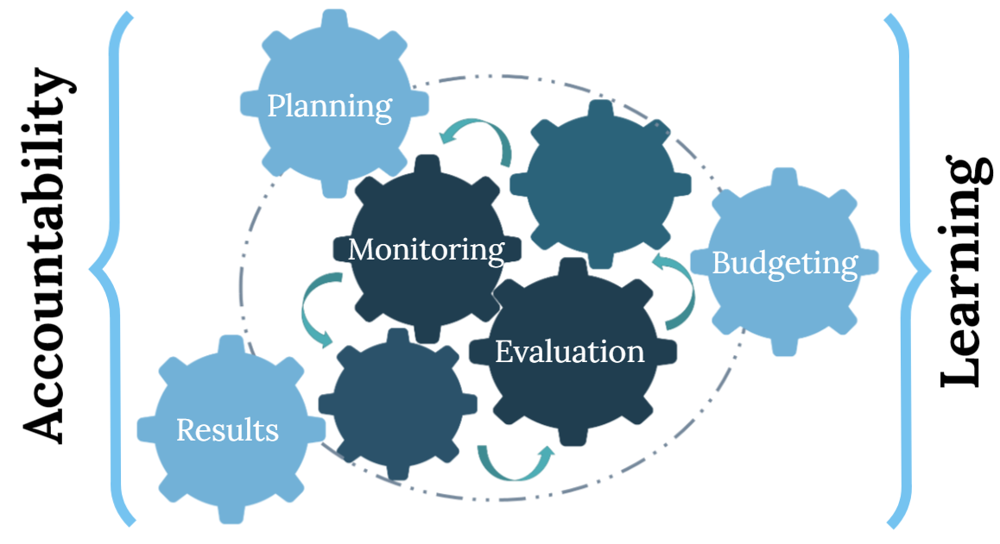
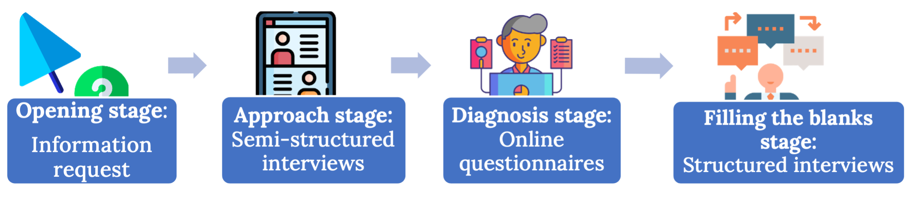

# Methodology {#section3}

This section presents the methodology and approach of the preparedness diagnostic used under this collaboration to strengthen RBM in the Community. It also presents the strengths and limitations of the methodology that should be considered when analysing the results or future replication exercises.

## Theory of Change of a sustainable RBM System 

The collaboration addresses an implementation deficit of public policies of CARICOM Member States that results in   poor resolution of socio-economic problems which affects the well-being of the citizens..

The diagram below shows a summarized theory of change of the collaborations’ activity for which this report is part of. As shown, and described in previous sections, this report is a result of conducting a thorough RBM preparedness diagnostic. The four consecutive stages that comprise the preparedness diagnostic provided relevant information that served as inputs for this report, but the implementation of these stages also served to have a contextual framework, to identify champions, to get buy-in from some stakeholders, and to start a networking process. All these additional gains will not only allow us to take the next steps but will continue to be strengthened during the workshops where contextualized roadmaps will be built.

This final report is the main input for the participatory workshops, for which specific processes have been defined and are presented in [section 5](#section5). The workshops will lead to the development of a contextualized roadmap with activities and responsibilities to advance towards sustainable RBM systems and practices, aligned to the four dimensions: _Institutional, Execution Framework, Technical Capabilities, and Use of Evidence_. These dimensions are further described in the following subsection and in the [Appendix A](#appendixA). 

The fulfilment and continuity of the activities integrating the roadmap, together with the continuous promotion and support of an enabling environment and a system of incentives with a whole of government approach, are expected to lead to the institutionalisation of the RBM system (understood as the existence, acknowledgement, and communication of clear rules); to the development of technical elements to support the system (understood as having developed capacity for generating and using the evidence that feeds the system); to having an organizational design and actual roll-out of the system (understood as having structures and processes designed and implemented for generating evidence and enabling the fulfilment of the normative framework); and finally, to a communication and persuasion strategy (understood as having timely access to evidence and knowing the paths to promote and measure its use).

***
```{r figure1, echo = FALSE, fig.cap = "Theory of Change", out.width = '100%'}
knitr::include_graphics("./images/figure_1.png")
```
***

As these four dimensions advance and become solid practices, beyond compliance, the system moves towards an increase in evidence-based decision making across government and across planning, budgeting, and implementation that makes it possible to increase public policies’ efficiency, efficacy, and effectiveness.

As the RBM system is sustained and  it continues to matures, the dimensions will continue to strengthen, and the enabling environment will promote an RBM culture that  ultimately contributes to the improved  well-being of all citizens.


## Ideal RBM system and working process {#section3.2}

The development of an RBM System is a complex and nonlinear process that must be contextualized to the specific region, country, or institution. To establish a roadmap to strengthen or build an RBM system, the following three elements are considered:

  1. A benchmark against which to assess the level of maturity dubbed as “Ideal RBM System”
  2.	A methodology to obtain general and specific recommendations and,
  3.	A working process  and approach to generate ownership 
  

The Ideal RBM system was established based on the good practices and lessons learned from multiple RBM initiatives in various contexts. These good practices represented useful inputs to determine ideal features of an RBM System. The CLEAR LAC team engaged in this collaboration defined four dimensions of an ideal sustainable RBM system (see [Figure 2](#fig:figure2)):

***
```{r figure2, echo = FALSE, fig.cap = "Dimensions of an ideal RBM system", out.width = '100%'}
knitr::include_graphics("./images/figure_2.png")
```
***
- _Institutionalisation:_ this dimension focuses on the formal rules that outline the RBM policy in the countries.

- _Execution framework:_ this dimension focuses on the systems, resources, processes, methodologies, and tools necessary for the implementation of an RBM system, as well as on the enabling environment. 

- _Technical capabilities:_ this dimension focuses on the necessary capacities and abilities to implement an RBM System.

- _Use of evidence:_ this dimension focuses on the dissemination strategies and incentives aimed at stakeholders with the purpose that they use the evidence generated by the RBM System. 

Each dimension is integrated by key elements that constitute specific documents, normative frameworks, activities, incentives, among others. These different elements facilitate the operationalisation of the dimension as part of an RBM System. In a third level (beneath dimensions and elements), each element has sub-elements that list their ideal characteristics. 

Once all the required information is gathered and analysed (based on the dimension-element-subelement structure), the dimensions will be assessed using a  3-level scale for each sub-element (no, yes, need of improvement)^[For more details on the 3-level scale see [appendix A](#appendixA)] . For this last step, the degree of advance in each sub-element within an element is added up to end up with a value of advance for each element; afterwards, all the element values within each dimension are added up to find the degree of progress of each dimension. 

Finally, the average from the progress of the four dimensions places each Member State in a specific level of progress (Early initiatives; Committed development; Growing RBM system; Consolidated practices, or Mature state) in the development and implementation of an RBM System (see [appendix A](#appendixA) for more details).

The working process, defined for this collaboration, identifies Monitoring and Evaluation (M&E) activities as central elements to be developed and applied to influence planning, budgeting, and implementation. [Figure 3](#fig:figure3) presents the working process and highlights the importance of evidence-based decision making (guided and made feasible by M&E activities and supported, strengthened, and made sustainable through learning and accountability). 

***
```{r figure3, echo = FALSE, fig.cap = "Working Process defined for the CARICOM Collaboration", out.width = '100%'}

```
***

One significant component to strengthen RBM in the Community is to build, through a participatory process, specific roadmaps to continue the development of RBM Systems for each pilot member state and Regional Institution. The Member States and Regional Institutions participating in the pilot have relevant but heterogeneous advances achieving this goal. To identify these advances, guide the analysis of the Preparedness Diagnostic stages, and develop ownership, the roadmap will be developed in workshops with key stakeholders involved in different levels (management, coordination, and operation).

## Stages of the Preparedness Diagnostic

The Preparedness Diagnostic (PD) is a four-stage methodology designed to gain a deep understanding of a Member State’s relevant aspects/characteristics when developing an RBM System. One main assumption behind the methodological design of the PD is that building a sustainable RBM System requires the active involvement of multiple stakeholders. The stages of the PD use different data collection methods to identify and engage these stakeholders as well as obtaining information to understand the current policy environment; stakeholder's interests, their roles, motivations, relationship dynamics; map existing institutional structures, practices, and mechanisms; and define capacity building needs.

To successfully execute the PD for this collaboration, the CLEAR LAC team, in collaboration with CARICOM Secretariat, selected Executive Coordinators who are representatives for the collaboration from the three Member States (Dominica, Jamaica and Saint Lucia) and the three Regional Institutions (the Caribbean Development Fund, the Caribbean Examinations Council and the CARICOM Implementation Agency for Crime and Security). The role of the Executive Coordinators was key to execute the PD as they have an overall knowledge of their Member State or Regional Institution and have experience in RBM as they have been part of the efforts of their Member State or Regional Institution. As Executive Coordinators for this collaboration, they acted as focal points and contributed to identifying and reaching relevant stakeholders at different stages of the PD and acted as key informants given their experience.

### Stages of the PD {-}

The four stages of the PD (presented in [Figure 4](#fig:figure4) ) are implemented according to a specific  sequence and were customized based on the findings of the previous stage. They also involve the participation of different stakeholders to obtain a broad perspective of the pilot Member States and Regional Institutions. The figure below provides a brief description of the approach for implementing the stages.

***
```{r figure4, echo = FALSE, fig.cap = "Stages of the Preparedness Diagnostic", out.width = '100%'}

```
***

The **Opening stage** consisted of a request for different documents from the Executive Coordinators, regarding the pilots’ planning, budgeting, and M&E practices. The desk review and analysis of these documents, in addition to other publicly available information, allowed the design of targeted  customized questions for each pilot in the next stage.

The **Approach stage** involved the identification of various  key stakeholders with the support  of the Executive Coordinators and the CARICOM Secretariat. The semi-structured interviews addressed general themes that allowed the team to develop rapport with relevant actors within the pilots, as well as obtain additional information about the pilots’ current policy environment.

The **Diagnosis stage** consisted of a series of online questionnaires for the Ministries, Agencies, and Departments of Member States, and Units of Regional Institutions. This stage aimed to gather more in-depth information to complement what was already gathered in previous stages, and to deepen in a whole of government approach. The participants were able to respond to questions and upload documents in a timeframe of approximately four weeks, as well as consult with other stakeholders for any additional information within their pilot Member States or Regional Institution.

Finally, the **Filling-the-blanks** stage was aimed at addressing information gaps from the previous stages through a series of structured interviews. This stage targeted other stakeholders such as members of Parliament, representatives of multilateral international organizations, development partners, etc.

All the information gathered in the four stages was systematized and analysed to present the findings in this document.

Table: (\#tab:table1) Dominica’s Preparedness Diagnostic Numbers

| | | |
| :-------- | :-------------: | ---------------------: |
|     | **Stage 1 – Opening**       | Information request to Executive Coordinator + document analysis (+50 documents) + research on official websites. |
|    | **Stage 2 – Approach**      |  7 semi-structured interviews were conducted by the CLEAR LAC team with relevant stakeholders from different MDAs              |
|     | **Stage 3 – Diagnosis**  | +100 online questionnaires were sent to MDAs and were answered with both the whole-of-government and MDA approaches.  |
|   | **Stage 4 – Filling the blanks** | No structured interviews were conducted by the CLEAR LAC team. |


### Strengths of the PD {-}

-	Different stages were designed to identify specific stakeholders and to generate rapport with them. 

-	As the stages are implemented and analysed sequentially, different layers of information are gathered

-	Participatory process that leads to the Member States or RI’s ownership of the collaboration

-	Qualitative and quantitative mixed methods used

All stages are adapted for to consider the context of each Member State or RI

### Limitations of the PD {-}

-	Specific results for one pilot cannot be generalized to others given the customization of the instruments and contextual differences among them

-	There are time limitations due to tight agendas of stakeholders that complicates reaching all the desired informants.

-	All stages were implemented remotely, and it is preferred to have some face-to-face contact with the stakeholders in at least one of the stages to generate rapport

-	The duration of the PD is approximately six effective months; however this was extended due to the whole of government/institution approach and the stakeholders’ agendas.


