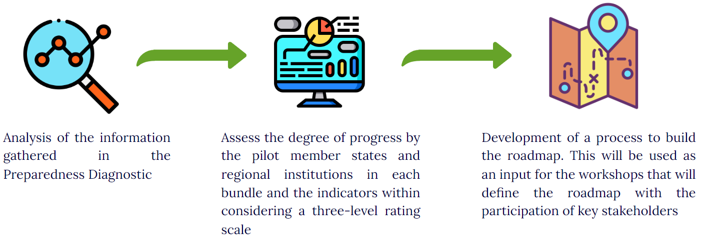

# Next steps to building the roadmap  {#section6}

RBM entails more than just abiding with certain requirements. Compliance is in adequate since it entails a change of mindset on the way things are done. This change of mindset involves different areas and stages of a government period. Having reviewed the main results from the preparedness diagnostic in terms of the dimensions of elements considered as part of an ideal RBM system, this section introduces the next steps that will be carried out as part of the process of building contextualized roadmaps. 

The roadmap will present pathways to influence planning, budgeting, implementation, and the M&E functions, as well as the promotion of accountability and learning. The main objective is for Dominica to have a defined action course that also specifies responsibilities and shows the importance of the participation of all relevant stakeholders.

***
```{r figure6, echo = FALSE, fig.cap = "From an ideal RBM system to the roadmaps", out.width = '100%'}

```
***

The whole process has a coproduction approach, were aside of the CLEAR LAC team, the CARICOM Secretariat, and the Executive Coordinators, key stakeholders will be involved in a fluid process to develop a learning loop for  feedback and process improvement.

***
```{r figure7, echo = FALSE, fig.cap = "Learning loop", out.width = '75%'}
knitr::include_graphics("./images/figure_7.png")
```
***

This report is considered as the _starting point_ in this process; take into consideration that, as [figure 7](#fig:figure7) illustrates, the process started before its publication. 

Once the first draft was completed, it will be shared with key stakeholders for review and validation, starting with the Executive Coordinators. Once the feedback period concluded, the report itself became an input for what is to come and will be disseminated to generate knowledge, support the sensitisation and empowerment of key stakeholders to strengthen RBM practices, and promote ownership of the next steps.

The next steps start with _defining the road_, engaging key stakeholders to coproduce contextualized medium term roadmaps that will include specific activities and milestones that will facilitate implementation. To develop the roadmap, the CLEAR LAC team has designed a series of workshops with the participation of stakeholders involved in the different areas and levels of what is to be the national RBM system, and that have been carefully identified as part of the PD process. 

To _move forward_, this first draft of the roadmap is presented to other relevant stakeholders to build consensus and support for the process. It is crucial to gain whole-of-government ownership, so it is important to define and implement a dissemination strategy for _sharing milestones_ in different levels: internal, external and regional, once they have been clearly defined and responsibilities have been assigned. Finally, it is important to _track the progress_ of implementation and communicate results to ensure that the Member State learns from the process, adjusts and stays in the correct path. The continuum process of identifying, sharing, reviewing, and adjusting represents a learning loop.

## Stakeholders’ contribution analysis

This section presents an analysis of stakeholders to identify which of them are relevant to strengthening the RBM system. Each of these stakeholders are involved in the decision making and execution at varied levels. Based on the CLEAR LAC’s team analysis, a proposal of the possible contribution of the stakeholders (considering positions and experience) is summarised below to support the improvement of the system which will  generate the necessary evidence and results for decision-making planning, budgeting .

The analysis is summarized (but not limited only, due to the constant change in the dynamics in which the stakeholders relate) in the following table. During the roadmap development workshops that will be held with government stakeholders, new stakeholders could be identified or some of those presented here could be discarded. Once its RBM Policy is approved and published, we will be able to have greater clarity on the roles, responsibilities, capacities, and relevance of the stakeholders that will integrate the system both at MDA and whole-of-government approach.


```{r , echo=FALSE, results="asis"}
library(readxl)
library(kableExtra)

stake <- read_excel("./Data/stakeholders.xlsx")

kable(stake,  caption = "Stakeholders’ contribution analysis") %>%
          kable_paper("striped", full_width = T, font_size = 14) %>%
          column_spec(1, bold = T, border_right = T) %>%
          column_spec(2, width = "30em") %>% 
          footnote( general = "Developed by the CLEAR LAC technical team in charge of the collaboration") %>%
        scroll_box(width = "700px", height = "300px")
          

```


